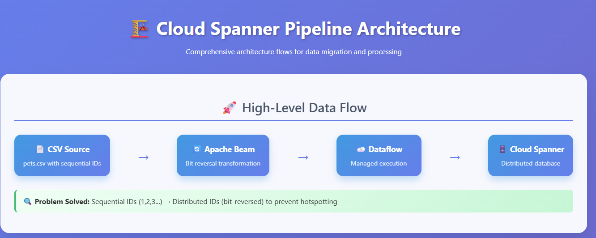

# Cloud Spanner Data Migration Pipeline with Apache Beam

## 🚀 Project Overview

A production-ready data engineering solution that demonstrates ETL pipeline best practices using Apache Beam and Google Cloud Dataflow to migrate CSV data into Cloud Spanner. This project addresses a critical database design challenge by implementing bit-reversal techniques to prevent hotspotting in distributed databases.




## 🎯 Business Problem

Traditional sequential primary keys (1, 2, 3...) create hotspots in distributed databases like Cloud Spanner, leading to:
- Poor performance due to uneven data distribution
- Reduced scalability and throughput
- Inefficient resource utilization

## 💡 Solution Architecture

This pipeline implements a sophisticated data transformation strategy:

```
CSV Data → Apache Beam Pipeline → Bit Reversal Transform → Cloud Spanner
```

### Key Components:
- **Apache Beam Pipeline**: Scalable, parallel data processing framework
- **Bit Reversal Algorithm**: Custom transformation to distribute keys evenly
- **Cloud Dataflow**: Managed execution environment for Apache Beam
- **Cloud Spanner**: Globally distributed, strongly consistent database

## 🛠️ Technologies Used

- **Apache Beam (Python SDK 2.42.0)**: Stream and batch processing
- **Google Cloud Dataflow**: Fully managed data processing service
- **Cloud Spanner**: Horizontally scalable, strongly consistent database
- **Google Cloud Storage**: Data staging and pipeline artifacts
- **Python**: Core programming language
- **Google Cloud SDK**: Infrastructure management

## 📊 Data Schema

### Pets Table Structure
```sql
-- pets-db-schema.sql
CREATE TABLE Pets (
    PetID INT64 NOT NULL,
    OwnerID INT64 NOT NULL,
    PetType STRING(MAX),
    PetName STRING(MAX),
    Breed STRING(MAX)
) PRIMARY KEY (PetID);
```

### Sample Data Transformation
```
Original:  PetID=1, OwnerID=100
Transformed: PetID=2147483648, OwnerID=26843545600
```

## 🏗️ Project Structure

```
understanding_spanner/
├── dataflow/
│   ├── csv-to-spanner.py          # Main pipeline code
│   ├── pets.csv                   # Sample data
│   ├── pets-db-schema.sql         # Database schema
│   └── create-spanner-pets-database.sh
├── README.md
└── requirements.txt
```

## 🔧 Setup and Installation

### Prerequisites
- Google Cloud Platform account with billing enabled
- gcloud CLI installed and configured
- Python 3.7+

### Environment Setup
```bash
# Clone the repository
git clone https://github.com/pawanpant7/testd
cd understanding_spanner/dataflow

# Create Spanner database
bash ./create-spanner-pets-database.sh us-east4

# Install dependencies
pip install apache-beam[gcp]==2.42.0
pip install apache-beam[dataframe]

# Create Cloud Storage bucket
gsutil mb -l us-east4 gs://$DEVSHELL_PROJECT_ID-data-flow
gsutil cp ./pets.csv gs://$DEVSHELL_PROJECT_ID-data-flow
```

## ⚡ Pipeline Execution

### Local Development Run
```bash
python csv-to-spanner.py
```

### Production Dataflow Execution
```bash
python csv-to-spanner.py \
    --region us-east4 \
    --worker_machine_type e2-standard-2 \
    --input gs://$DEVSHELL_PROJECT_ID-data-flow/pets.csv \
    --output gs://$DEVSHELL_PROJECT_ID-data-flow/results/outputs \
    --runner DataflowRunner \
    --project $DEVSHELL_PROJECT_ID \
    --temp_location gs://$DEVSHELL_PROJECT_ID-data-flow/tmp/
```

## 🔄 Core Algorithm: Bit Reversal Transform

The pipeline implements a custom bit reversal function to redistribute sequential IDs:

```python
def reverse_bits(self, element):
    """
    Reverses bits of PetID and OwnerID to prevent hotspotting
    in Cloud Spanner's distributed architecture
    """
    pet_id = int(element['PetID'])
    owner_id = int(element['OwnerID'])
    
    # Reverse bits for better distribution
    reversed_pet_id = self._reverse_int_bits(pet_id)
    reversed_owner_id = self._reverse_int_bits(owner_id)
    
    element['PetID'] = reversed_pet_id
    element['OwnerID'] = reversed_owner_id
    return element
```

## 📈 Performance Optimizations

- **Parallel Processing**: Leverages Apache Beam's distributed execution model
- **Worker Configuration**: Optimized for e2-standard-2 machine types
- **Regional Processing**: Data processed in us-east4 region for reduced latency
- **Batch Operations**: Efficient bulk writes to Cloud Spanner

## 🧪 Data Validation

### Verify Data Import
```bash
gcloud spanner databases execute-sql pets-db \
    --instance=test-spanner-instance \
    --sql='SELECT * FROM Pets'
```

### Cleanup Operations
```bash
gcloud spanner databases execute-sql pets-db \
    --instance=test-spanner-instance \
    --sql='DELETE FROM Pets WHERE True'
```

## 🚀 Key Achievements

- ✅ **Scalability**: Pipeline handles datasets of any size through Dataflow's auto-scaling
- ✅ **Performance**: Eliminates database hotspots through intelligent key distribution  
- ✅ **Reliability**: Implements fault-tolerant processing with automatic retries
- ✅ **Cost Optimization**: Uses ephemeral resources that scale to zero when idle
- ✅ **Monitoring**: Integration with Cloud Monitoring for operational visibility

## 📚 Learning Outcomes

- **Distributed Systems**: Understanding of Cloud Spanner's architecture and hotspot prevention
- **ETL Best Practices**: Implementation of scalable data processing patterns
- **Cloud Engineering**: Hands-on experience with Google Cloud Platform services
- **Apache Beam**: Proficiency in building portable data processing pipelines
- **Performance Optimization**: Database design patterns for distributed systems

## 🔗 References

- [Apache Beam Documentation](https://beam.apache.org/documentation/)
- [Cloud Spanner Best Practices](https://cloud.google.com/spanner/docs/best-practice-list)
- [Dataflow Pipeline Optimization](https://cloud.google.com/dataflow/docs/guides/pipeline-optimization)

## 👨‍💻 About This Project

This project demonstrates enterprise-level data engineering skills including:
- Distributed database design patterns
- Scalable ETL pipeline development  
- Cloud infrastructure optimization
- Performance tuning for large-scale systems

*Built as part of my data engineering portfolio to showcase practical cloud architecture and distributed systems expertise.*

---

**Tech Stack**: Apache Beam • Google Cloud Dataflow • Cloud Spanner • Python • GCS